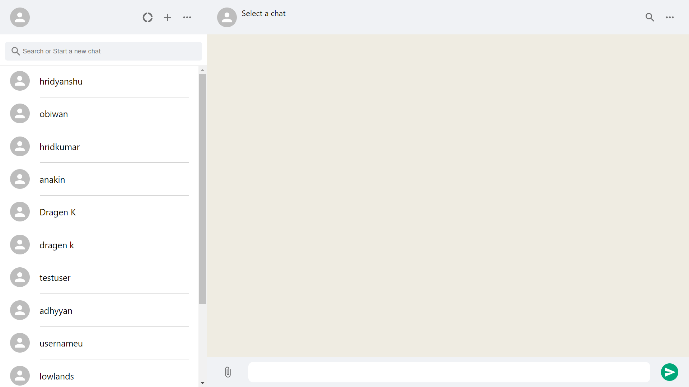
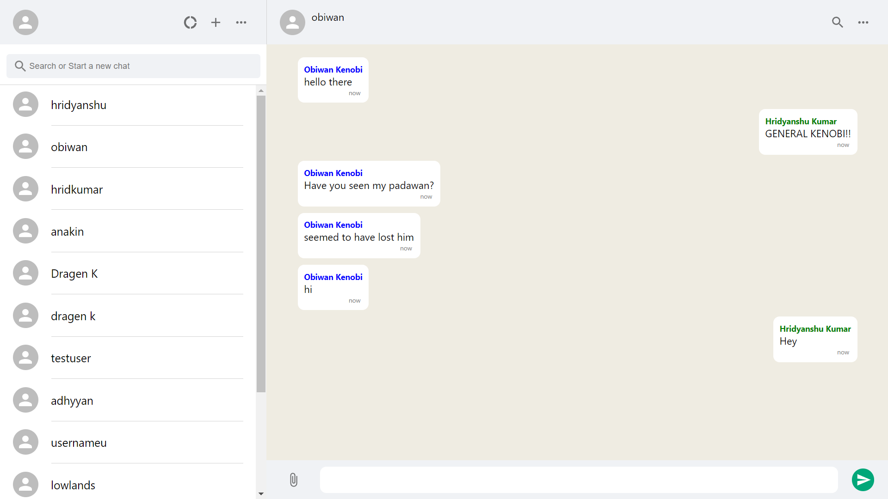
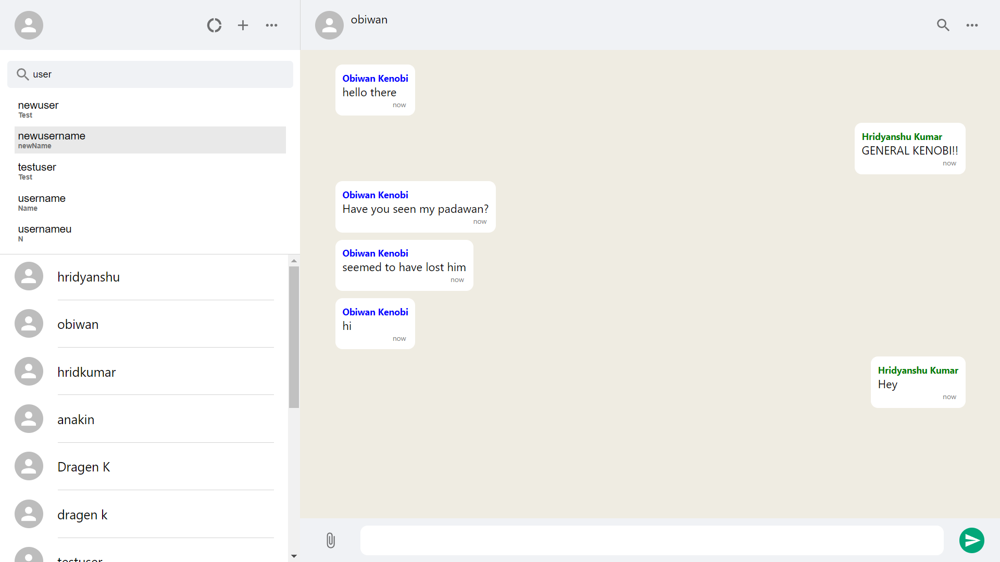
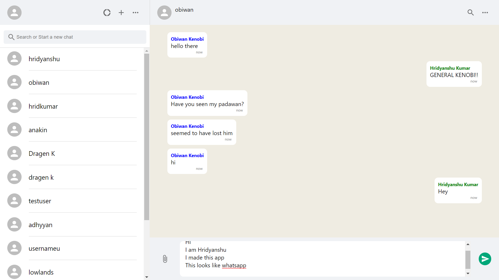
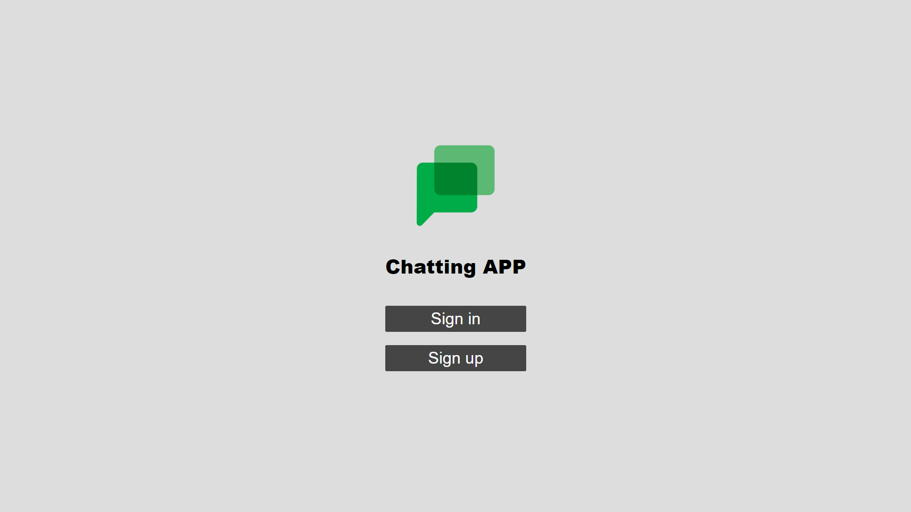
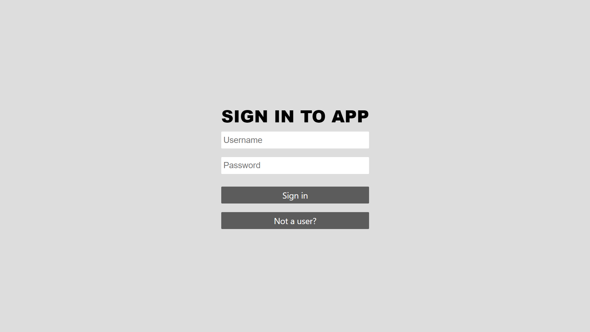
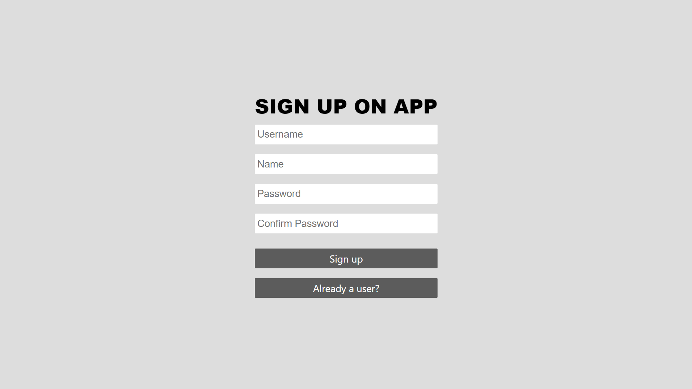

# chatting-app

<a href="https://whistl.netlify.app">Link to hosted website</a>

## All Pages:
 
 
<b>Main page (No chat selected)</b>

 

<b>Chat selected</b>

 

<b>Searching for existing users</b>

 

<b>Sending messages</b>

 

<b>Home page</b>

 

<b>Sign in page</b>

 

<b>Sign up page</b>

 

